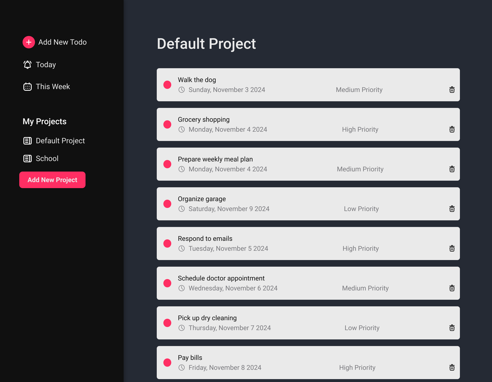

# Todo Web App

A simple and dynamic Todo web application to help you manage and organize your tasks efficiently. This app allows you to create multiple projects, set priorities, and manage due dates for each task. It also supports data persistence in `localStorage`, so your tasks are saved even after refreshing the browser.

See live on - https://imbob99.github.io/todo-app/

## Features

- **Multi-Project Support**: Organize tasks by projects (e.g., "Default Project", "Second Project").
- **Priority Levels**: Assign priority levels to tasks (High, Medium, Low).
- **Due Date Management**: Easily set due dates for tasks using a date picker.
- **Persistent Storage**: Data is stored in `localStorage`, ensuring your tasks remain intact after browser refreshes.
- **Real-Time Task Display**: Automatically displays tasks for the selected project.

## Technologies Used

- **HTML/CSS**: For structuring and styling the application.
- **JavaScript (ES6)**: Core functionality and dynamic interactions.
- **Webpack**: Module bundler to manage and compile assets.
- **date-fns**: Utility library for managing and formatting dates.

## Usage

### Adding a Project
1. Enter a project name and click "Create Project".
2. The project will appear in the sidebar, and you can add tasks to it.

### Adding Tasks
1. Select a project to focus on.
2. Use the "Add Task" form, set the task name, priority, and due date, then click "Add".
3. The task appears under the selected project.
